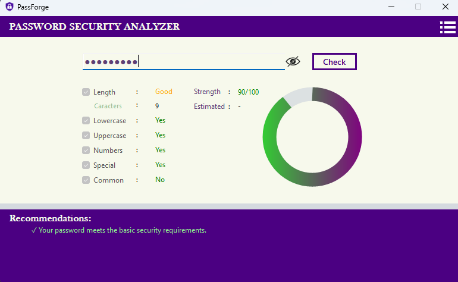
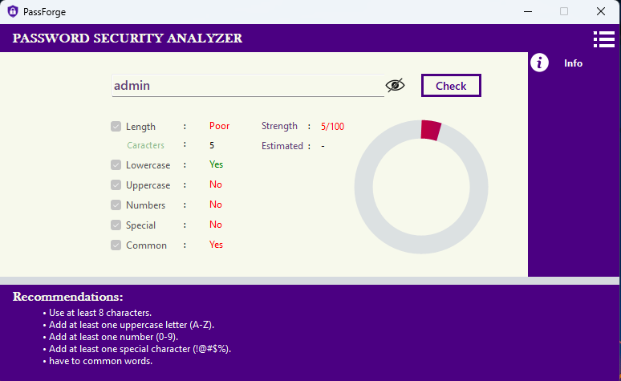

# 🔐 PassForge

**PassForge** is a desktop-based password security analyzer built with **C# and .NET Windows Forms**. It evaluates password strength based on multiple security criteria and provides a visual security score with personalized recommendations.



## 📌 Overview

PassForge helps users understand how secure their passwords are by analyzing different password characteristics such as length, character types, special characters, and common-password patterns.

The application provides a simple and modern interface with a circular progress indicator, security status indicators, and recommendations for improving weak passwords.

## ✨ Features

* 🔐 Password strength analysis
* 📊 Visual password security score
* 🔵 Circular progress indicator
* 🔤 Uppercase character detection
* 🔡 Lowercase character detection
* 🔢 Number detection
* 🔣 Special character detection
* 📏 Password length analysis
* ⚠️ Common password detection
* 💡 Personalized security recommendations
* 👁️ Show / hide password
* ⌨️ Press **Enter** to analyze the password
* 🏠 Home page
* ℹ️ Information / About page
* 🎨 Dynamic UI colors based on password strength
* 🖥️ Windows Forms desktop interface

## 🛡️ Password Analysis

PassForge evaluates passwords using several security factors:

| Security Factor | Description                                       |
| --------------- | ------------------------------------------------- |
| Length          | Checks whether the password has sufficient length |
| Uppercase       | Checks for uppercase letters `A-Z`                |
| Lowercase       | Checks for lowercase letters `a-z`                |
| Number          | Checks for numeric characters `0-9`               |
| Symbol          | Checks for special characters such as `! @ # $ %` |
| Common Password | Detects commonly used passwords                   |

## 📊 Strength Score

The application calculates a score based on the detected security characteristics.

The score is displayed using a circular progress indicator and changes color according to the password strength.

```text
🔴 Weak
🟠 Moderate
🟡 Good
🟢 Strong
```

## 💡 Recommendations

PassForge provides recommendations based on the weaknesses detected in the password.

For example:

```text
• Use at least 8 characters.
• Add at least one uppercase letter (A-Z).
• Add at least one number (0-9).
• Add at least one special character (!@#$%).
```
### 🔐 Common Password Detection

PassForge checks whether a password matches commonly used or easily guessable passwords. Passwords such as `password`, `123456`, `qwerty`,`admin` and similar predictable combinations are considered weak because they are frequently targeted in password attacks.

If a common password is detected, PassForge reduces the overall security score and provides a recommendation to choose a more unique and secure password.

**Example:**

```text
Password: admin

Common Password: ❌ Detected

Recommendation:
• Avoid commonly used passwords.
• Choose a unique password with a combination of
  uppercase, lowercase, numbers, and special characters.
```

This feature helps users avoid predictable passwords and improve their overall password security.

Only the recommendations relevant to the detected weaknesses are displayed.



## 🖥️ User Interface

The application contains:

* Home page
* Password analyzer
* Password strength score
* Security requirement indicators
* Recommendation panel
* Information page
* Show / hide password functionality

## 🛠️ Technologies Used

* **C#**
* **.NET**
* **Windows Forms (WinForms)**
* **Visual Studio**
* **Guna UI / Guna UI2**
* Object-Oriented Programming (OOP)

## 📂 Project Structure

```text
PassForge/
│
├── PassForge/
│   ├── Service/
│   │   └── Check.cs
│   │
│   ├── forms/
│   │   ├── home_details.cs
│   │   └── info_form.cs
│   │
│   ├── Form1.cs
│   ├── Form1.Designer.cs
│   ├── Program.cs
│   └── ...
│
├── PassForge.sln
└── README.md
```

## 🚀 Getting Started

### Requirements

Before running PassForge, make sure you have:

* Windows
* Visual Studio
* .NET SDK / .NET Runtime compatible with the project
* Required NuGet packages

### Installation

1. Clone the repository:

```bash
git clone https://github.com/your-username/PassForge.git
```

2. Open the project:

```text
PassForge.sln
```

in Visual Studio.

3. Restore the required NuGet packages.

4. Build the project.

5. Run the application.

## 🔍 How to Use

1. Launch **PassForge**.
2. Enter a password into the password field.
3. Click **Check** or press **Enter**.
4. PassForge analyzes the password.
5. Review the security score.
6. Check the security requirements.
7. Follow the recommendations to improve the password.

## 🔒 Privacy

PassForge is designed as a local desktop application. Password analysis is performed within the application rather than requiring the password to be uploaded to an external web service.

**Never use real passwords when testing software that you do not trust.**

## 🎯 Project Goals

The main goals of PassForge are to:

* Help users understand password security.
* Encourage the use of stronger passwords.
* Demonstrate password-analysis concepts.
* Practice C# and .NET Windows Forms development.
* Apply object-oriented programming concepts to a practical project.
* Build a modern cybersecurity-focused desktop application.

## 🔮 Future Improvements

Planned improvements may include:

* [ ] Password entropy calculation
* [ ] Estimated password cracking time
* [ ] Improved common-password database
* [ ] Repeated-character detection
* [ ] Sequential-character detection
* [ ] Pattern detection
* [ ] Password generator
* [ ] Password history
* [ ] Dark / Light themes
* [ ] Improved animations
* [ ] More advanced password scoring algorithm

## ⚠️ Disclaimer

PassForge is an educational password-strength analysis tool. Its score should not be considered a guarantee that a password is completely secure.

Password security depends on many factors, including password uniqueness, storage practices, multi-factor authentication, and the security of the systems where passwords are used.

## 👨‍💻 Author

**Kalhara Nonis**

[](https://www.linkedin.com/in/kalhara-nonis/)

Developed as a C# / .NET cybersecurity-focused project.

## 📄 License

This project is intended for educational and development purposes.
